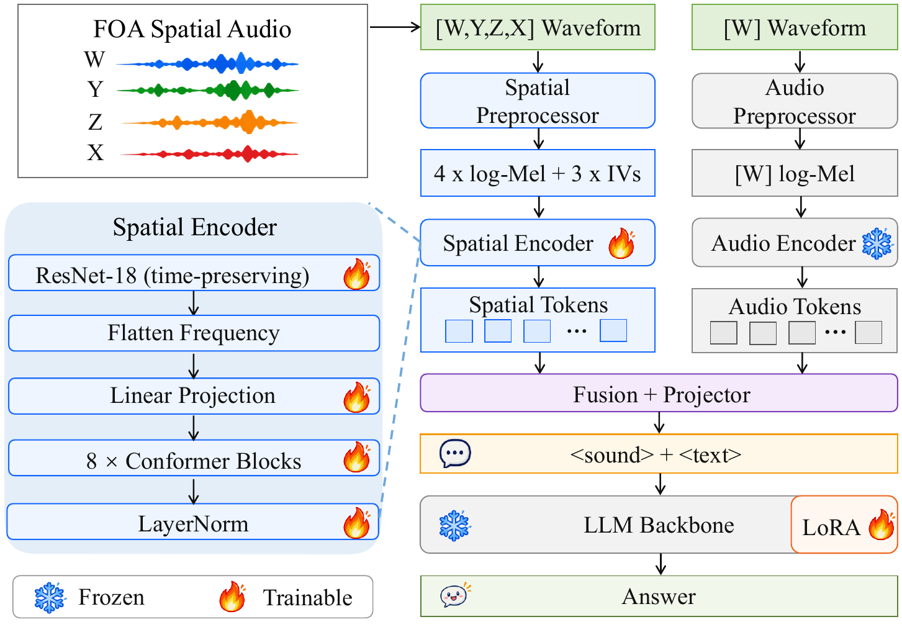

# RMS-AQA: Real-World Multi-Hop Spatial Audio Question Answering Challenge

[](https://huggingface.co/datasets/PeacefulData/RMS-AQA)
[](https://rmsaqachallenge.github.io)

RMS-AQA is a real-world multi-hop spatial audio question answering benchmark accepted as an **ICASSP 2027 Signal Processing Grand Challenge**. The benchmark evaluates whether audio-language models can identify what happened, where and when it happened, and how to respond to complex questions grounded in spatial audio.

## Task

RMS-AQA is built from 10-second First-Order Ambisonics (FOA) recordings collected in smart-home environments. The challenge is organized as a two-stage reasoning task:

1. **Stage 1:** identify the sound events present in the scene.
2. **Stage 2:** use the Stage 1 semantic response as context to answer complex spatio-temporal questions.

Stage 2 covers six question dimensions:

- **Sound counting (SC)**
- **Spatial location (SL)**
- **Temporal detection (TD)**
- **Temporal relation (TR)**
- **Spatial relation (SR)**
- **Action prediction (AP)**

## Dataset

The RMS-AQA dataset contains both synthetic and recorded data. The training set is fully synthetic, the validation set combines synthetic and recorded examples, and the hidden evaluation set consists entirely of recorded data. All audio clips are provided in four-channel, 24 kHz, 10-second FOA format.

The downloadable release contains the training and validation splits, including audio clips and their corresponding question-answer pairs. Download the dataset from the [RMS-AQA Dataset](https://huggingface.co/datasets/PeacefulData/RMS-AQA).

### QA JSONL schema

Each record contains a 10-second audio segment and its two-stage question pair. Stage 1 identifies the sound events present in the scene; Stage 2 asks a complex spatio-temporal question conditioned on the Stage 1 context. For multiple-choice questions, `answer` is the option letter and `options` maps each letter to its text. Stage 2 questions additionally carry `category_id` (`1`–`6`: SC, SL, TD, TR, SR, AP) and `category_name`.

```json
{
  "records": [
    {
      "segment_id": "train-000000.json",
      "qa_pairs": [
        {
          "stage": 1,
          "question": "What types of sound events can be heard in this audio?",
          "answer": "D",
          "options": {
            "A": "The recording includes key drop.",
            "B": "In the audio, you can hear dishwasher.",
            "C": "The clip contains indoor cricket chorus.",
            "D": "The audible sound types are child shouting."
          }
        },
        {
          "stage": 2,
          "question": "If a domestic robot were monitoring this audio, what should its response plan be?",
          "answer": "D",
          "options": {
            "A": "The best next step is to log and continue passive monitoring for dishwasher near the front-left area.",
            "B": "For this clip, the embodied assistant should trigger a home emergency alert, notify, and monitor safely for child shouting near the front-left area.",
            "C": "The appropriate response plan is to trigger a home emergency alert, notify, and monitor safely for dishwasher near the rear area.",
            "D": "Because of the detected sound, the robot should make a non-intrusive check and notify for child shouting near the rear area."
          },
          "category_id": 6,
          "category_name": "Action Prediction"
        }
      ]
    }
  ]
}
```

## Baseline

Our baseline augments a monaural audio encoder with a trainable spatial branch. The spatial encoder receives the four-channel FOA input, while the audio encoder receives only the omnidirectional FOA **W** channel.

To preserve the semantic capabilities of large audio-language models (LALMs), the audio encoder and LLM backbone remain frozen. The spatial encoder, fusion module, and LLM LoRA adapters are trainable. During training, Stage 2 is conditioned on the reference Stage 1 answer to form the conversational context. During inference, the model instead conditions Stage 2 on the generated Stage 1 response.

<figure>
  
  <figcaption>Overview of the RMS-AQA spatial audio baseline. The spatial branch processes four-channel FOA features and is fused with the frozen monaural audio-language pathway.</figcaption>
</figure>


## Results

**Table 1.** Overall and category-wise accuracy (%) on the RMS-AQA validation set. `A_S1`, `A_S2`, and `A_GS2` denote Stage-1, raw Stage-2, and grounded Stage-2 accuracy, respectively. Rows marked “+ SpatialAug” report the adapted versions of the corresponding backbones.

<table>
  <thead>
    <tr>
      <th rowspan="2" style="white-space: nowrap;">System</th>
      <th colspan="3">Overall</th>
      <th colspan="6">Raw Stage-2 A<sub>S2</sub></th>
      <th colspan="6">Grounded Stage-2 A<sub>GS2</sub></th>
    </tr>
    <tr>
      <th>A<sub>S1</sub></th>
      <th>A<sub>S2</sub></th>
      <th>A<sub>GS2</sub></th>
      <th>SC</th>
      <th>SL</th>
      <th>TD</th>
      <th>SR</th>
      <th>TR</th>
      <th>AP</th>
      <th>SC</th>
      <th>SL</th>
      <th>TD</th>
      <th>SR</th>
      <th>TR</th>
      <th>AP</th>
    </tr>
  </thead>
  <tbody>
    <tr><td style="white-space: nowrap;">Audio&nbsp;Flamingo&nbsp;3</td><td>41.02</td><td>34.00</td><td>15.78</td><td>29.50</td><td>31.10</td><td>28.10</td><td>39.00</td><td>40.10</td><td>36.20</td><td>9.80</td><td>14.60</td><td>14.60</td><td>17.30</td><td>20.80</td><td>17.60</td></tr>
    <tr><td style="white-space: nowrap;">+&nbsp;SpatialAug</td><td>63.98</td><td>52.60</td><td>39.10</td><td>59.10</td><td>36.40</td><td>48.90</td><td>45.40</td><td>57.30</td><td>68.50</td><td>46.40</td><td>25.20</td><td>36.90</td><td>29.80</td><td>44.30</td><td>52.00</td></tr>
    <tr><td style="white-space: nowrap;">Audio&nbsp;Flamingo&nbsp;Next</td><td>41.18</td><td>35.57</td><td>15.95</td><td>35.40</td><td>31.90</td><td>28.30</td><td>37.70</td><td>40.30</td><td>39.80</td><td>13.10</td><td>14.20</td><td>13.20</td><td>16.10</td><td>19.90</td><td>19.20</td></tr>
    <tr><td style="white-space: nowrap;">+&nbsp;SpatialAug</td><td>65.93</td><td>60.23</td><td>45.17</td><td>69.30</td><td>40.80</td><td>62.70</td><td>47.90</td><td>62.20</td><td>78.50</td><td>54.50</td><td>29.00</td><td>46.40</td><td>33.40</td><td>49.30</td><td>58.40</td></tr>
    <tr><td style="white-space: nowrap;">MiDashengLM</td><td>23.63</td><td>34.97</td><td>9.40</td><td>46.20</td><td>28.40</td><td>24.00</td><td>36.40</td><td>39.60</td><td>35.20</td><td>13.90</td><td>6.80</td><td>6.70</td><td>9.60</td><td>10.80</td><td>8.60</td></tr>
    <tr><td style="white-space: nowrap;">+&nbsp;SpatialAug</td><td>66.85</td><td>59.70</td><td>44.68</td><td>66.10</td><td>40.20</td><td>62.80</td><td>47.10</td><td>60.70</td><td>81.30</td><td>50.00</td><td>28.80</td><td>48.10</td><td>33.40</td><td>47.70</td><td>60.10</td></tr>
    <tr><td style="white-space: nowrap;">Qwen3-Omni</td><td>37.70</td><td>34.90</td><td>16.72</td><td>43.40</td><td>26.80</td><td>32.60</td><td>27.80</td><td>40.70</td><td>38.10</td><td>17.90</td><td>13.30</td><td>15.50</td><td>14.40</td><td>22.40</td><td>16.80</td></tr>
    <tr><td style="white-space: nowrap;">+&nbsp;SpatialAug</td><td>66.70</td><td>63.45</td><td>48.93</td><td>69.40</td><td>42.20</td><td>71.20</td><td>52.50</td><td>66.40</td><td>79.00</td><td>54.20</td><td>31.40</td><td>54.40</td><td>38.30</td><td>54.40</td><td>60.90</td></tr>
    <tr><td style="white-space: nowrap;">GPT&nbsp;Audio&nbsp;1.5</td><td>37.28</td><td>33.05</td><td>17.07</td><td>43.50</td><td>21.70</td><td>25.70</td><td>21.80</td><td>37.30</td><td>48.30</td><td>23.60</td><td>10.80</td><td>12.40</td><td>11.50</td><td>19.30</td><td>24.80</td></tr>
    <tr><td style="white-space: nowrap;">Gemini&nbsp;3.1&nbsp;Pro</td><td>52.45</td><td>46.42</td><td>29.55</td><td>50.00</td><td>29.40</td><td>56.40</td><td>33.40</td><td>57.20</td><td>52.10</td><td>32.70</td><td>18.30</td><td>32.50</td><td>22.90</td><td>36.80</td><td>34.10</td></tr>
    <tr><td style="white-space: nowrap;">Qwen3.8-Omni-Flash</td><td>59.63</td><td>54.53</td><td>36.38</td><td>57.80</td><td>36.60</td><td>68.50</td><td>38.40</td><td>64.30</td><td>61.60</td><td>39.40</td><td>24.40</td><td>44.10</td><td>26.80</td><td>43.60</td><td>40.00</td></tr>
  </tbody>
</table>

## Repository layout

```text
.
├── assets/
│   ├── model.pdf                         
│   └── model.png                         
├── spatial_af3/
│   ├── __init__.py                      
│   ├── dataset.py                        # Dataset loading and QA formatting
│   ├── evaluation.py                     # Evaluation and inference routines
│   ├── feature_ops.py                    # FOA and spatial feature operations
│   ├── mcq.py                            # Multiple-choice question utilities
│   ├── metrics.py                        # Accuracy and evaluation metrics
│   ├── models/
│   │   ├── __init__.py                   # Model package initialization
│   │   ├── af3_generative_backbone.py    # AF3 generative backbone integration
│   │   ├── spatial_encoder.py            # Spatial feature encoder
│   │   └── spatial_generative.py         # Spatial generative model
│   └── utils.py                          # Shared helper functions
├── spatial_models/
│   ├── conformer.py                      # Conformer sequence blocks
│   └── resnet.py                         # Time-preserving ResNet blocks
├── eval_spatial_plugin.py                # Evaluate the spatial plug-in
├── preprocess_audio_features.py          # Pre-extract audio and spatial features
├── train_spatial_plugin.py               # Train the spatial plug-in
└── requirements.txt                      # Python dependencies
```

## Installation

```bash
git clone https://github.com/rmsaqachallenge/rmsaqa-code.git
cd rmsaqa-code
conda create -n rms-aqa python=3.10 -y
conda activate rms-aqa
pip install -r requirements.txt
```
